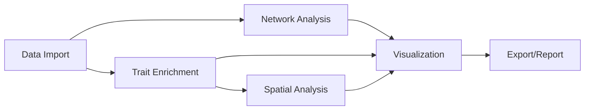

<div align="center">

# EcoNeTool

### Marine Food Web Network Analysis Tool

[](https://github.com/razinkele/EcoNeTool/actions/workflows/ci.yml)
[](https://github.com/razinkele/EcoNeTool/releases)
[](LICENSE)
[](https://www.r-project.org/)
[](https://github.com/razinkele/EcoNeTool/commits)
[](https://github.com/razinkele/EcoNeTool/issues)

</div>

---

## Overview

EcoNeTool is an interactive R Shiny dashboard for analyzing trophic interactions, biomass distributions, and energy fluxes in marine food webs. It combines qualitative and quantitative network analysis with trait enrichment, spatial habitat integration, and Rpath/Ecosim modeling in a single reproducible workflow. Developed as part of the HORIZON EUROPE [MARBEFES project](https://cordis.europa.eu/project/id/101060937) at Klaipėda University, the tool supports marine biodiversity and ecosystem functioning research across European regional seas. It bridges the gap between food web datasets (EwE, CSV, RData) and publication-ready network analyses.

## Live Demo

> [!NOTE]
> A live instance is hosted at **[http://laguna.ku.lt:3838/EcoNeTool/](http://laguna.ku.lt:3838/EcoNeTool/)** — try it without installing anything locally.

## Key Features

| Category | Feature |
|---|---|
| **Network Analysis** | Topological metrics (connectance, generality, vulnerability), iterative trophic levels, keystoneness via Mixed Trophic Impact, energy flux calculations with `fluxweb` |
| **Trait Research** | 12 integrated databases (WoRMS, OBIS, FishBase, SeaLifeBase, BVOL, SpeciesEnriched, AlgaeBase, SHARK, freshwaterecology.info, and more), provenance badge system, ML-based trait prediction, phylogenetic imputation |
| **Spatial Analysis** | EMODnet EUSeaMap habitat integration, hexagonal grid aggregation, regional bounding-box filtering, Leaflet interactive maps |
| **Rpath / Ecosim** | Import EwE databases, parameter and diet matrix editors, real-time balancing diagnostics, Ecosim simulations |
| **Metawebs** | Regional metaweb databases (Baltic, Lithuanian Coast, Gulf of Riga) with export to RData |
| **Data Import/Export** | EwE (.ewemdb, .eweaccdb), CSV, Excel, RData; download plots, tables, and full network objects |

## Quick Start

> [!TIP]
> Choose whichever entry point fits your workflow — all three launch the same app.

```r
# 1. From a shell (recommended for reproducibility)
Rscript run_app.R

# 2. From RStudio — open the project and click "Run App"
shiny::runApp()

# 3. With auto-launch in your default browser
shiny::runApp(launch.browser = TRUE)
```

## Installation

<details>
<summary><b>Prerequisites and install steps</b></summary>

### Prerequisites

- **R** ≥ 4.0.0 (tested with 4.4.1)
- **OS**: Linux, macOS, or Windows
- **Memory**: ≥ 4 GB RAM recommended
- **Disk**: ≥ 500 MB for packages and cached data

### Install dependencies

```r
# Automatic — installs everything the app needs
source("deployment/install_dependencies.R")
```

Or install the core set manually:

```r
install.packages(c(
  "shiny", "bs4Dash", "igraph", "fluxweb", "visNetwork",
  "DT", "MASS", "leaflet", "sf"
))
```

### Verify

```bash
Rscript deployment/pre-deploy-check.R
# Expected: ALL CHECKS PASSED — Application is ready for deployment!
```

</details>

## Architecture



## Project Structure

<details>
<summary><b>Directory tree</b></summary>

```
EcoNeTool/
├── app.R                    # Main Shiny app entry point
├── run_app.R                # Application launcher
├── R/
│   ├── config.R             # Global constants (COLOR_SCHEME, etc.)
│   ├── config/              # Plugins, harmonization config
│   ├── functions/           # Analysis + API integration (41 files)
│   │   ├── trait_lookup/    # Trait database lookups
│   │   ├── ecopath/         # ECOPATH import
│   │   └── rpath/           # Rpath integration
│   ├── ui/                  # UI modules, one per dashboard tab
│   └── modules/             # Shiny server modules
├── data/                    # Datasets (CSV, Rdata, trait databases)
├── examples/                # Example EwE files + LTCoast.Rdata default
├── metawebs/                # Regional metaweb data
├── deployment/              # Deploy scripts and checklists
├── tests/                   # testthat + custom test suites
├── docs/                    # User and developer documentation
├── www/                     # Static web assets
├── CHANGELOG.md
└── LICENSE
```

</details>

## Data Format

<details>
<summary><b>Required structure, supported formats, and functional groups</b></summary>

EcoNeTool needs two components: a **network adjacency matrix** (who eats whom) and a **species information table**.

### Supported formats

- **RData** — `net` (igraph object) + `info` (data.frame)
- **CSV / Excel** — network matrix + species info table
- **EwE** — native `.ewemdb` / `.eweaccdb` / `.mdb`, or exported CSV

### Required columns in `info`

| Column | Type | Description | Example |
|---|---|---|---|
| `species` | character | Species name | "Cod" |
| `meanB` | numeric | Mean biomass (g/m²) | 1250.5 |
| `fg` | factor | Functional group | "Fish" |
| `bodymasses` | numeric | Individual body mass (g) | 50.0 |
| `met.types` | character | Metabolic type | "ectotherm vertebrates" |
| `efficiencies` | numeric | Assimilation efficiency (0–1) | 0.85 |

### Functional groups (with default colour scheme)

| Group | Colour |
|---|---|
| Benthos | Burlywood |
| Birds | Purple |
| Detritus | Brown |
| Fish | Blue |
| Mammals | Red |
| Phytoplankton | Green |
| Zooplankton | Light blue |

### Minimal example

```r
library(igraph)
net  <- graph_from_adjacency_matrix(adjacency_matrix, mode = "directed")
info <- data.frame(
  species       = c("Species_A", "Species_B", "Species_C"),
  fg            = factor(c("Fish", "Zooplankton", "Phytoplankton")),
  meanB         = c(1250.5, 850.2, 2100.0),
  bodymasses    = c(50.0, 0.5, 0.001),
  met.types     = c("ectotherm vertebrates", "invertebrates", "Other"),
  efficiencies  = c(0.85, 0.75, 0.40)
)
save(net, info, file = "MyFoodWeb.Rdata")
```

The default bundled dataset is the **Lithuanian Coastal Food Web** (`examples/LTCoast.Rdata`) — 41 species, 244 trophic links across 6 functional groups.

</details>

## Analysis Features

### Network Metrics

Species richness (S), connectance (C), generality (G), vulnerability (V), iterative trophic levels, omnivory (SD of prey TL), and biomass-weighted variants that account for species abundance.

### Trait Research

Twelve integrated databases with smart routing based on taxonomy, ultra-fast in-memory lookups (0.4–0.6 ms), provenance badges indicating trait source and confidence (0.85–0.95), and ML-based trait prediction (Random Forest, ~79% accuracy) plus phylogenetic imputation for gaps. Token-bucket rate limiting protects remote APIs.

### Spatial Analysis

EMODnet EUSeaMap habitat integration with regional bbox filtering (10–20× faster than full loads), hexagonal grid spatial aggregation of species occurrences, and Leaflet-based interactive maps with tooltips.

### Rpath / Ecosim

Import native EwE databases, edit group parameters and diet matrices before balancing, receive real-time balancing diagnostics, and run Ecosim dynamic simulations on balanced models.

## Documentation

- [API Reference](docs/API_REFERENCE.md)
- [User Manual](docs/USER_MANUAL.md)
- [Changelog](CHANGELOG.md)
- [Deployment Guide](deployment/README.md)
- [Documentation Hub](docs/README.md)

### Scientific references

- **Brown, J. H., et al. (2004).** Toward a metabolic theory of ecology. *Ecology*, 85(7), 1771–1789.
- **Bersier, L. F., et al. (2002).** Quantitative descriptors of food web matrices. *Ecology*, 83(9), 2394–2407.
- **Libralato, S., et al. (2006).** A method for identifying keystone species in food web models. *Ecological Modelling*, 195(3–4), 153–171.
- **Williams, R. J., & Martinez, N. D. (2004).** Limits to trophic levels and omnivory in complex food webs. *Proc. Roy. Soc. B*, 271(1540), 549–556.
- **Gauzens, B., et al. (2019).** fluxweb: An R package to easily estimate energy fluxes in food webs. *Methods Ecol. Evol.*, 10(2), 270–279.
- **Kortsch, S., Frelat, R., Pecuchet, L., et al.** *Qualitative and quantitative network descriptors reveal complementary patterns of change in temporal food web dynamics.*

Original tutorial: [BalticFoodWeb](https://rfrelat.github.io/BalticFoodWeb.html) · [BalticFoodWeb on GitHub](https://github.com/rfrelat/BalticFoodWeb)

## Deployment

<details>
<summary><b>Production deployment to Shiny Server</b></summary>

> [!WARNING]
> Deployment requires SSH access to `laguna.ku.lt` as user `razinka`, sudo privileges on the target host, and a pre-deploy check that passes locally. Never deploy without running the validation script first.

```bash
# 1. Validate locally
Rscript deployment/pre-deploy-check.R

# 2. Deploy
./deploy.sh                       # Unix/macOS
powershell ./deploy-windows.ps1   # Windows

# 3. Verify
sudo ./deployment/verify-deployment.sh
```

If the server shows a stale build, run `sudo ./deployment/force-reload.sh` to stop the server, clear caches, and redeploy. See [deployment/README.md](deployment/README.md) for full instructions and troubleshooting.

</details>

## Contributing

Contributions are welcome — see [CONTRIBUTING.md](CONTRIBUTING.md) for the full workflow. In short: fork, branch, run `Rscript deployment/pre-deploy-check.R`, and open a PR.

**Code style:** snake_case functions, `<-` for assignment, 120-char max line length, no tabs or trailing whitespace. `lintr` and pre-commit hooks enforce this automatically. Shiny modules follow the `*_ui.R` / `*_server.R` naming pattern.

## Citation

If you use EcoNeTool in your research, please cite:

```bibtex
@software{econetool2025,
  title = {EcoNeTool: Marine Food Web Network Analysis Tool},
  author = {MARBEFES Project Team},
  year = {2025},
  version = {1.4.2},
  institution = {Klaipėda University},
  url = {https://github.com/razinkele/EcoNeTool},
  note = {Interactive R Shiny application for marine food web analysis}
}
```

Methodology builds on Kortsch et al. (temporal food web dynamics) and the BalticFoodWeb tutorial by Frelat & Kortsch (2020). See the scientific references above for all underlying methods.

## Authors & Acknowledgments

**Authors** — MARBEFES Project Team, Klaipėda University, Lithuania.

**Funding** — [HORIZON EUROPE MARBEFES](https://cordis.europa.eu/project/id/101060937): *Marine Biodiversity and Ecosystem Functioning leading to Ecosystem Services*.

**Data sources & libraries**
- Gulf of Riga food web: Frelat, R. & Kortsch, S. (2020)
- `fluxweb` R package: Gauzens, B., et al. (2019)
- Original BalticFoodWeb analysis tools and methodology
- EMODnet EUSeaMap for habitat data
- WoRMS, OBIS, FishBase, SeaLifeBase, AlgaeBase, SHARK, BVOL, freshwaterecology.info

## License

This project is dual-licensed:

- **[GPL-3.0](LICENSE)** for source code
- <a rel="license" href="http://creativecommons.org/licenses/by-sa/4.0/"></a> **Creative Commons Attribution-ShareAlike 4.0 International** for documentation and data

## Contact & Support

- **Issues & feature requests** — [GitHub Issues](https://github.com/razinkele/EcoNeTool/issues)
- **Source** — [github.com/razinkele/EcoNeTool](https://github.com/razinkele/EcoNeTool)
- **Project** — [MARBEFES on CORDIS](https://cordis.europa.eu/project/id/101060937)

---

## Version Information

**Current Version**: 1.4.2
**Last Updated**: 2025-12-26
**Status**: Production Ready

<!-- VERSION:1.4.2 -->

See [CHANGELOG.md](CHANGELOG.md) for detailed version history.
